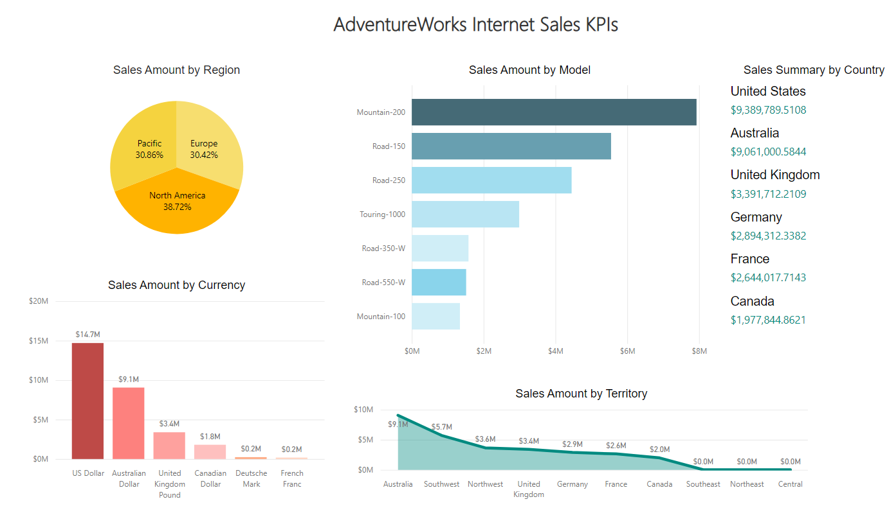
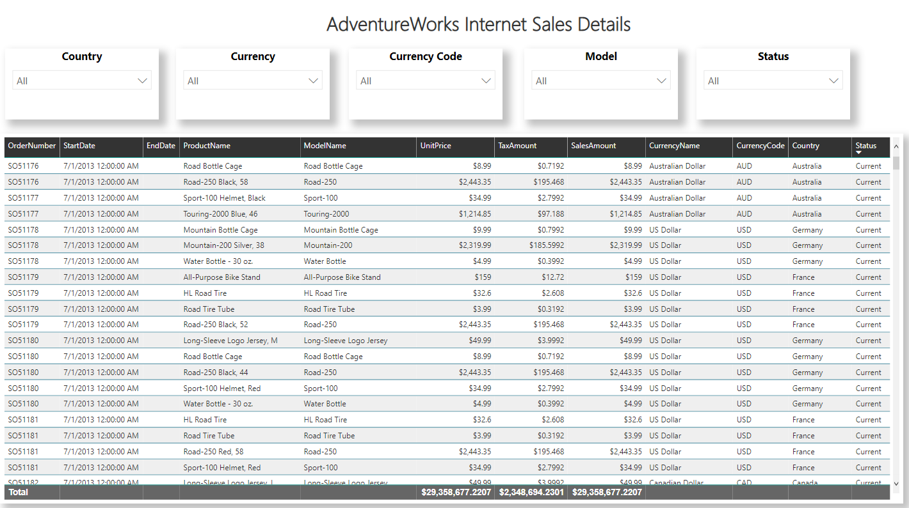
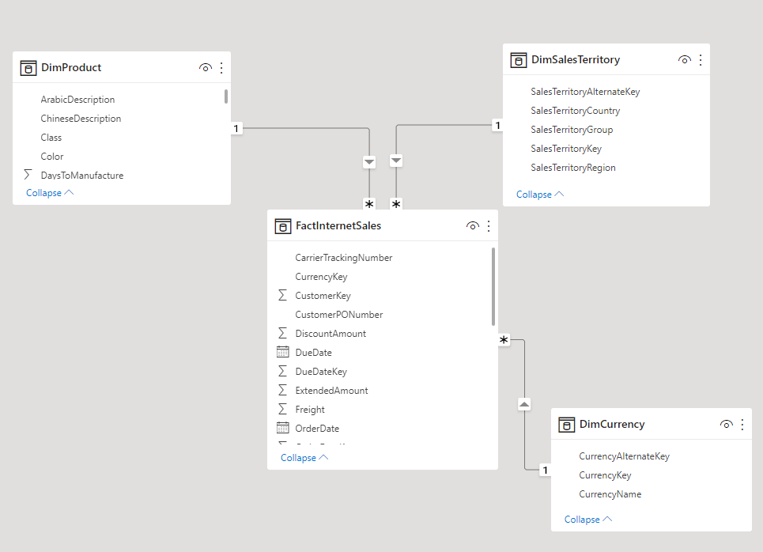

# Data Visualization
This repository contains visualizations created with Business Intelligence tools such as Power BI, or Python libraries (Seaborn, Matplotlib, Bokeh, etc.). Working in progress ...

## Content of this Repository:
- InternetSales20220614.pbix: Power BI file with two pages; a Dashboard and a Report detail. Both pages showcase KPIs and its corresponding details from the AdventureWorksDW2019. If you are not familiar with the AdventureWorksDW2019 database, you may find more details here: https://docs.microsoft.com/en-us/sql/samples/adventureworks-install-configure?view=sql-server-ver15&tabs=tsql
- RestoringDBusingBLinux.ipynb: Jupyter Notebook explaining how to restore a database in a Linux system using T-SQL. Also you may find more information about how to restore a SQL Server database in the link above.

### Power BI Visualization
**InternetSales20220614.pbix** is a simple Power BI visualization that demonstrates using dimension and fact tables from an OLAP system. In these case I am using the famous ***AdventureWorksDW2019*** database. The file consists of two basic pages:
- *InternetSalesDashboard*: A basic dashboard which gives the user a quick overview of key business indicators. In this case, sales.

- *InternetSalesTable*: A basic report featuring a table and some slicers which gives the user the ability to select what he wants to see. 

And this is the data model used to build the InternetSales visualization. Note the star schema depicted below. There is one Fact table: FactInternetSales, and three Dimension tables: DimProduct, DimSalesTerritory, and DimCurrency. 

